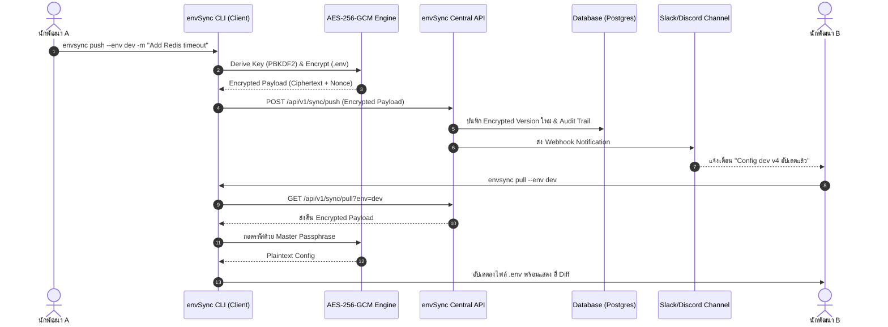

# 🔒 envSync (Dev Environment Config Sync Engine)

> **Platform Engineering & DevSecOps Config Management System**  
> ระบบเครื่องมือ CLI และ API หลังบ้านระดับองค์กร สำหรับจัดการ ซิงก์ และรักษาความปลอดภัยไฟล์ `.env` ป้องกัน Secret รั่วไหล และขจัดปัญหา Configuration Drift ระหว่างทีมพัฒนาอย่างสมบูรณ์แบบ

[](https://github.com/jakkayy/envSync/actions)
[](https://github.com/jakkayy/envSync/actions)
[](https://go.dev)
[](LICENSE)
[](https://github.com/jakkayy/envSync/releases)

---

## 📑 สารบัญ (Table of Contents)
- [📌 ปัญหาที่เข้ามาแก้และวิสัยทัศน์ (Vision & Problem Statement)](#-ปัญหาที่เข้ามาแก้และวิสัยทัศน์-vision--problem-statement)
- [🏗️ สถาปัตยกรรมระบบและโมเดลความปลอดภัย (Architecture & Security Model)](#-สถาปัตยกรรมระบบและโมเดลความปลอดภัย-architecture--security-model)
- [📥 วิธีการติดตั้งทั้งหมดอย่างละเอียด (Comprehensive Installation Guide)](#-วิธีการติดตั้งทั้งหมดอย่างละเอียด-comprehensive-installation-guide)
  - [วิธีที่ 1: ติดตั้งผ่านสคริปต์อัตโนมัติ (Linux / macOS)](#วิธีที่-1-ติดตั้งผ่านสคริปต์อัตโนมัติ-linux--macos)
  - [วิธีที่ 2: ดาวน์โหลด Pre-built Binary จาก GitHub Release](#วิธีที่-2-ดาวน์โหลด-pre-built-binary-จาก-github-release)
  - [วิธีที่ 3: คอมไพล์จาก Source Code (Go build / Make)](#วิธีที่-3-คอมไพล์จาก-source-code-go-build--make)
  - [วิธีที่ 4: การรันผ่าน Docker Container](#วิธีที่-4-การรันผ่าน-docker-container)
- [💻 คู่มือการใช้งาน CLI คำสั่งต่อคำสั่ง (Complete CLI Command Reference)](#-คู่มือการใช้งาน-cli-คำสั่งต่อคำสั่ง-complete-cli-command-reference)
  - [1. `envsync init` (เริ่มต้นโปรเจกต์)](#1-envsync-init-เริ่มต้นโปรเจกต์)
  - [2. `envsync push` (เข้ารหัสและส่งขึ้นส่วนกลาง)](#2-envsync-push-เข้ารหัสและส่งขึ้นส่วนกลาง)
  - [3. `envsync pull` (ดึงค่าล่าสุดมาถอดรหัสในเครื่อง)](#3-envsync-pull-ดึงค่าล่าสุดมาถอดรหัสในเครื่อง)
  - [4. `envsync diff` (เปรียบเทียบความต่าง)](#4-envsync-diff-เปรียบเทียบความต่าง)
  - [5. `envsync history` (ดูประวัติการแก้ไข)](#5-envsync-history-ดูประวัติการแก้ไข)
  - [6. `envsync rollback` (ย้อนกลับเวอร์ชัน)](#6-envsync-rollback-ย้อนกลับเวอร์ชัน)
  - [7. `envsync run` (ฉีด Secret เข้า Memory โดยไม่ลงดิสก์)](#7-envsync-run-ฉีด-secret-เข้า-memory-โดยไม่ลงดิสก์)
  - [8. `envsync export k8s` (ส่งออกเป็น Kubernetes Secret)](#8-envsync-export-k8s-ส่งออกเป็น-kubernetes-secret)
  - [9. `envsync completion` (เปิดใช้งาน Shell Auto-complete)](#9-envsync-completion-เปิดใช้งาน-shell-auto-complete)
  - [10. `envsync version` (ตรวจสอบเวอร์ชัน)](#10-envsync-version-ตรวจสอบเวอร์ชัน)
- [🛠️ การติดตั้งและตั้งค่า API Server ส่วนกลาง (Central Server Deployment)](#️-การติดตั้งและตั้งค่า-api-server-ส่วนกลาง-central-server-deployment)
- [🧪 การทดสอบระบบและการสแกนความปลอดภัย (Testing & QA)](#-การทดสอบระบบและการสแกนความปลอดภัย-testing--qa)
- [❓ คำถามที่พบบ่อยและการแก้ปัญหา (FAQ & Troubleshooting)](#-คำถามที่พบบ่อยและการแก้ปัญหา-faq--troubleshooting)

---

## 📌 ปัญหาที่เข้ามาแก้และวิสัยทัศน์ (Vision & Problem Statement)

ในการทำงานร่วมกันของทีมพัฒนาซอฟต์แวร์ ไฟล์ `.env` มักเป็นจุดเปราะบางที่สุดที่สร้างความยุ่งยากและไร้ความปลอดภัย:

| ปัญหาจริงในทีม (Traditional Problem) | แนวทางการแก้ปัญหาด้วย `envSync` |
|---|---|
| **Onboarding Friction:** สมาชิกใหม่เข้าทีมต้องไล่ทักขอไฟล์ `.env` จากเพื่อน | รัน `envsync pull` ดึง Config ทั้งหมดลงเครื่องได้ใน 1 วินาที |
| **Secret Leaks:** ส่งรหัสผ่าน/API Key ผ่าน Slack, LINE, หรือ Email | ข้อมูลถูกเข้ารหัส **AES-256-GCM** ฝั่ง Client ก่อนส่ง (Zero-Knowledge) |
| **Configuration Drift:** เพื่อนอัปเดต Config ใหม่แล้วไม่ได้บอก ทำให้รันไม่ผ่าน | แจ้งเตือนผ่าน Slack Webhook และมีคำสั่ง `envsync diff` แสดงสีเปรียบเทียบ |
| **Plaintext on Server Disk:** ไฟล์ `.env` หลุดบนดิสก์ Server | ใช้ `envsync run` ฉีด Secret เข้า Memory ของโปรเซสตรงๆ โดยไม่สร้างไฟล์ลงดิสก์ |

---

## 🏗️ สถาปัตยกรรมระบบและโมเดลความปลอดภัย (Architecture & Security Model)

`envSync` ใช้หลักการ **Zero-Knowledge Architecture** โดยที่ Central Server หลังบ้านจะ **ไม่มีทางอ่านค่ารหัสผ่านจริงได้เลย** เพราะกระบวนการเข้ารหัสเกิดขึ้นบนเครื่องของนักพัฒนา (Client-side) ก่อนส่งข้อมูลเสมอ



---

## 📥 วิธีการติดตั้งทั้งหมดอย่างละเอียด (Comprehensive Installation Guide)

### วิธีที่ 1: ติดตั้งผ่านสคริปต์อัตโนมัติ (Linux / macOS)
วิธีนี้ง่ายที่สุด สคริปต์จะตรวจสอบสถาปัตยกรรมเครื่องของคุณ (x86_64 หรือ arm64) และดาวน์โหลด Binary เวอร์ชันล่าสุดมาติดตั้งที่ `/usr/local/bin/envsync` อัตโนมัติ:

```bash
curl -fsSL https://raw.githubusercontent.com/jakkayy/envSync/main/scripts/install.sh | sh
```

---

### วิธีที่ 2: ดาวน์โหลด Pre-built Binary จาก GitHub Release
หากต้องการติดตั้งด้วยตนเอง สามารถเข้าไปที่หน้า [GitHub Releases](https://github.com/jakkayy/envSync/releases) แล้วเลือกดาวน์โหลดตามระบบปฏิบัติการ:

1. **Linux (64-bit):**
   ```bash
   wget https://github.com/jakkayy/envSync/releases/download/v1.0.0/envSync_1.0.0_linux_amd64.tar.gz
   tar -xzf envSync_1.0.0_linux_amd64.tar.gz
   sudo mv envsync /usr/local/bin/
   ```

2. **macOS (Apple Silicon M1/M2/M3):**
   ```bash
   curl -LO https://github.com/jakkayy/envSync/releases/download/v1.0.0/envSync_1.0.0_darwin_arm64.tar.gz
   tar -xzf envSync_1.0.0_darwin_arm64.tar.gz
   sudo mv envsync /usr/local/bin/
   ```

3. **Windows (64-bit):**
   - ดาวน์โหลด `envSync_1.0.0_windows_amd64.zip`
   - แตกไฟล์ `.zip` และนำ `envsync.exe` ไปวางไว้ใน System Path (เช่น `C:\Windows\System32` หรือเพิ่มโฟลเดอร์ลงใน Environment Variables)

---

### วิธีที่ 3: คอมไพล์จาก Source Code (Go build / Make)
เหมาะสำหรับนักพัฒนาที่ต้องการแก้ไขโค้ดหรือ build ใช้เองในองค์กร:

**สิ่งที่ต้องมีก่อน (Prerequisites):**
- ภาษา **Go 1.22** ขึ้นไป (`go version`)
- โปรแกรม `make` และ `git`

**ขั้นตอนการทำ:**
```bash
# 1. Clone คลังโค้ดลงมาในเครื่อง
git clone https://github.com/jakkayy/envSync.git
cd envSync

# 2. สั่งคอมไพล์สร้างไฟล์ Binary ทั้งหมด
make build

# 3. ไฟล์ Binary จะถูกสร้างไว้ในโฟลเดอร์ bin/
./bin/envsync --help
./bin/server --help

# (Optional) ย้ายไปไว้ที่ System Path เพื่อเรียกใช้ได้จากทุกที่
sudo cp bin/envsync /usr/local/bin/
```

---

### วิธีที่ 4: การรันผ่าน Docker Container
หากต้องการรันตัว API Server ผ่าน Docker:

```bash
# สั่ง Build Docker Image ในเครื่อง
docker build -t envsync-server -f deployments/docker/Dockerfile .

# รัน Container
docker run -d -p 8080:8080 --name envsync-server envsync-server
```

---

## 💻 คู่มือการใช้งาน CLI คำสั่งต่อคำสั่ง (Complete CLI Command Reference)

### 1. `envsync init` (เริ่มต้นโปรเจกต์)
ใช้สร้างไฟล์ตั้งค่า `.envsync.json` ประจำโฟลเดอร์โปรเจกต์

* **รูปแบบคำสั่ง:**
  ```bash
  envsync init [flags]
  ```
* **ธงที่รองรับ (Flags):**
  - `-p, --project <string>` : กำหนดชื่อโปรเจกต์ (ถ้าไม่ระบุจะใช้ชื่อโฟลเดอร์ปัจจุบัน)
  - `-e, --env <string>` : กำหนดสภาพแวดล้อมตั้งต้น (Default: `dev`)
  - `--server <string>` : กำหนด URL ของ API Server ส่วนกลาง (Default: `http://localhost:8080`)
* **ตัวอย่าง:**
  ```bash
  $ envsync init --project payment-service --server http://localhost:8080
  
  ✔ Project 'payment-service' (ID: proj_4f14611c) initialized successfully.
  ✔ Config file .envsync.json created.
  ```

---

### 2. `envsync push` (เข้ารหัสและส่งขึ้นส่วนกลาง)
อ่านไฟล์ `.env` ในเครื่อง เข้ารหัสแบบ AES-256-GCM และยิงไปบันทึกเป็นเวอร์ชันใหม่บน Server

* **รูปแบบคำสั่ง:**
  ```bash
  envsync push [flags]
  ```
* **ธงที่รองรับ (Flags):**
  - `-e, --env <string>` : สภาพแวดล้อมเป้าหมาย เช่น `dev`, `staging`, `prod` (Default: `dev`)
  - `-m, --message <string>` : ข้อความบันทึกการเปลี่ยนแปลง (Commit message)
  - `-p, --password <string>` : รหัสผ่านหลักสำหรับเข้ารหัส (หากไม่ระบุจะดึงจากตัวแปร `ENVSYNC_PASSPHRASE`)
* **ตัวอย่าง:**
  ```bash
  $ envsync push --env dev -m "Add Redis connection timeout" -p "MySecretPassword123"
  
  🔒 Encrypting environment variables (AES-256-GCM)...
  ⬆️  Pushing 14 variables to project 'payment-service' (environment: dev)...
  ✅ Successfully updated! (Version: v4)
  ```

---

### 3. `envsync pull` (ดึงค่าล่าสุดมาถอดรหัสในเครื่อง)
ดึง Payload ที่เข้ารหัสแล้วจาก Server มาถอดรหัส และอัปเดตไฟล์ `.env` ในเครื่องโดยอัตโนมัติ

* **รูปแบบคำสั่ง:**
  ```bash
  envsync pull [flags]
  ```
* **ธงที่รองรับ (Flags):**
  - `-e, --env <string>` : สภาพแวดล้อมที่ต้องการดึง (Default: `dev`)
  - `-p, --password <string>` : รหัสผ่านหลักสำหรับถอดรหัส
* **ตัวอย่าง:**
  ```bash
  $ envsync pull --env dev -p "MySecretPassword123"
  
  ⬇️  Fetching latest config for 'payment-service' (environment: dev)...
  🔓 Decrypting environment variables...
  ✔ Local .env file updated successfully to version v4!
  ```

---

### 4. `envsync diff` (เปรียบเทียบความต่าง)
เปรียบเทียบ Key-Value ระหว่างไฟล์ `.env` ในเครื่องกับค่าล่าสุดบน Server พร้อมแสดงผลด้วยสีสัน

* **รูปแบบคำสั่ง:**
  ```bash
  envsync diff [flags]
  ```
* **ตัวอย่าง:**
  ```bash
  $ envsync diff --env dev
  
  Comparing local .env with remote (dev):
  
    + ADDED:    REDIS_TIMEOUT = 5000
    ~ MODIFIED: DB_HOST (localhost -> dev-db.internal.company.com)
    - REMOVED:  OLD_API_KEY (present in remote: xyz)
  
  Summary: 1 added, 1 modified, 1 removed, 10 unchanged.
  ```

---

### 5. `envsync history` (ดูประวัติการแก้ไข)
แสดง Timeline ประวัติการเปลี่ยนแปลงเวอร์ชันทั้งหมดประจำโปรเจกต์

* **รูปแบบคำสั่ง:**
  ```bash
  envsync history [flags]
  ```
* **ตัวอย่าง:**
  ```bash
  $ envsync history --env dev
  
  📜 Revision History for 'payment-service' (http://localhost:8080):
  
  REV    DATE                 USER             MESSAGE
  v4     2026-08-16 23:30     @naeiger         Add Redis connection timeout
  v3     2026-08-16 22:15     @alex_dev        Updated DB_HOST
  v2     2026-08-16 20:00     @john_dev        Initial database setup
  ```

---

### 6. `envsync rollback` (ย้อนกลับเวอร์ชัน)
ย้อนกลับค่า Config ในเครื่องไปใช้เวอร์ชันเดิมในประวัติ

* **รูปแบบคำสั่ง:**
  ```bash
  envsync rollback --to <version> [flags]
  ```
* **ตัวอย่าง:**
  ```bash
  $ envsync rollback --env dev --to 2
  
  ⏪ Rolling back 'payment-service' (environment: dev) to version v2...
  ✔ Local .env file successfully rolled back to version v2!
  ```

---

### 7. `envsync run` (ฉีด Secret เข้า Memory โดยไม่ลงดิสก์)
ดึง Secret จาก Server และถอดรหัสฉีดเข้า Process Memory ของโปรเซสลูกโดยตรง โดย **ไม่สร้างไฟล์ `.env` ลงบนดิสก์**

* **รูปแบบคำสั่ง:**
  ```bash
  envsync run [flags] -- <command> [args...]
  ```
* **ตัวอย่าง:**
  ```bash
  $ envsync run --env prod -- node server.js
  
  🚀 Executing command [node] with injected secrets (environment: prod)...
  Server listening on port 8080...
  ```

---

### 8. `envsync export k8s` (ส่งออกเป็น Kubernetes Secret)
แปลงค่าใน `.env` ให้อยู่ในรูปแบบ Kubernetes Secret YAML Manifest (Base64 Encoded)

* **รูปแบบคำสั่ง:**
  ```bash
  envsync export k8s [flags]
  ```
* **ธงที่รองรับ (Flags):**
  - `--name <string>` : ชื่อของ Kubernetes Secret (Default: `app-secret`)
  - `-n, --namespace <string>` : Namespace ใน K8s (Default: `default`)
  - `-o, --output <file>` : เส้นทางบันทึกไฟล์ (หากไม่ใส่จะพิมพ์ออก stdout)
* **ตัวอย่าง:**
  ```bash
  $ envsync export k8s --name payment-secret -n production -o secret.yaml
  
  ✔ Kubernetes Secret manifest successfully exported to 'secret.yaml'
  ```

---

### 9. `envsync completion` (เปิดใช้งาน Shell Auto-complete)
สร้างสคริปต์ Auto-complete เวลาผู้ใช้กด Tab ใน Terminal

* **ตัวอย่างตั้งค่า:**
  - **Bash:** `source <(envsync completion bash)`
  - **Zsh:** `source <(envsync completion zsh)`
  - **Fish:** `envsync completion fish | source`

---

### 10. `envsync version` (ตรวจสอบเวอร์ชัน)
```bash
$ envsync version

envSync CLI v1.0.0 (commit: 9cf7e41, built at: 2026-08-16T23:45:00Z)
```

---

## 🛠️ การติดตั้งและตั้งค่า API Server ส่วนกลาง (Central Server Deployment)

ตัว Backend Server ของ `envSync` ทำหน้าที่เป็นผู้ประสานงานจัดเก็บ Encrypted Payload และ Audit Logs

### 1. การรันด้วย Docker Compose (แนะนำ)
```bash
# รัน API Server ร่วมกับ PostgreSQL 16
docker-compose up -d

# ตรวจสอบสถานะการทำงาน
docker-compose ps
curl http://localhost:8080/health
```

### 2. รายชื่อตัวแปรสภาพแวดล้อมของ Server (Server Environment Variables)

| ตัวแปร (Variable) | คำอธิบาย (Description) | ค่าเริ่มต้น (Default) |
|---|---|---|
| `PORT` | พอร์ตที่ Web Server เปิดทำงาน | `8080` |
| `GIN_MODE` | โหมดการทำงาน (`debug` หรือ `release`) | `release` |
| `DB_TYPE` | ประเภทฐานข้อมูล (`postgres` หรือ `sqlite`) | `sqlite` |
| `DB_DSN` | Connection String สำหรับต่อฐานข้อมูล | `envsync.db` |
| `ENVSYNC_SKIP_AUTH` | ข้ามการตรวจ API Key (`true`/`false`) | `false` |

---

## 🧪 การทดสอบระบบและการสแกนความปลอดภัย (Testing & QA)

โปรเจกต์นี้มีชุดทดสอบครอบคลุมทั้ง Unit Tests และ Integration Tests:

```bash
# 1. รันการทดสอบ Unit Tests และ Integration Tests ทั้งหมด
make test

# 2. ตรวจสอบคุณภาพโค้ดด้วย Linter
make lint

# 3. สแกนช่องโหว่ความปลอดภัยภาษา Go ด้วย Gosec
gosec ./...

# 4. สแกนช่องโหว่คอนเทนเนอร์ด้วย Trivy
trivy fs .
```

---

## ❓ คำถามที่พบบ่อยและการแก้ปัญหา (FAQ & Troubleshooting)

### Q1: หากใส่ Master Passphrase ผิดตอน `pull` จะเกิดอะไรขึ้น?
**คำตอบ:** ระบบจะแสดงข้อความแจ้งเตือน `decryption failed (check passphrase)` และ **จะไม่แตะต้องหรือเขียนทับไฟล์ `.env` เดิมในเครื่องของคุณ** เพื่อความปลอดภัย

### Q2: ถ้า API Server หลังบ้านล่ม จะยังพัฒนาต่อได้ไหม?
**คำตอบ:** ได้ครับ ฟีเจอร์ในเครื่อง เช่น `envsync diff`, การเข้ารหัส/ถอดรหัสไฟล์ `.env`, การแปลงไฟล์เป็น Kubernetes Secret (`envsync export k8s`) สามารถทำงานแบบ Offline ในเครื่องได้ 100%

### Q3: จะนำ `envSync` ไปใช้ในระบบ CI/CD Pipeline (GitHub Actions / GitLab CI) ได้อย่างไร?
**คำตอบ:** สามารถตั้งค่าตัวแปร `ENVSYNC_TOKEN` และ `ENVSYNC_PASSPHRASE` ใน Repository Secrets แล้วใช้คำสั่ง `envsync run -- npm test` เพื่อฉีด Secret เข้าแรมในการรัน Test ได้ทันทีโดยไม่ต้องสร้างไฟล์ลงดิสก์

---

## 📄 ใบอนุญาต (License)
โปรเจกต์นี้จัดทำภายใต้ใบอนุญาต **MIT License** - สามารถนำไปใช้งาน ปรับแต่ง และแจกจ่ายได้อย่างอิสระ
