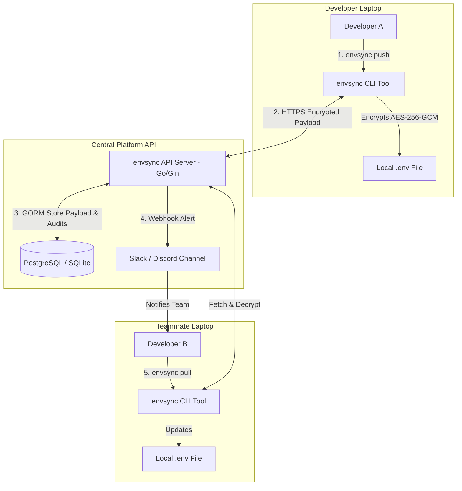

# 🔒 envSync (Dev Environment Config Sync CLI)

[](https://github.com/jakkayy/envSync/actions)
[](https://github.com/jakkayy/envSync/actions)
[](LICENSE)

> **Platform Engineering & DevSecOps Config Management Tool**  
> Protect, synchronize, and prevent configuration drift for local `.env` files across your development engineering team safely.

---

## 📌 Problem Statement

1. **"Can I get the `.env` file?"**: New team members spent hours asking colleagues for environment variables via Slack.
2. **Security Leakage**: Unencrypted credentials, API keys, and connection strings sent via unsecure chat or email.
3. **Configuration Drift**: Teammates update local configs without notifying others, leading to broken local environments and wasted debugging hours.

---

## 🏗️ Architecture Overview



---

## 🚀 Quick Start & CLI Usage

### 1. Initialize Project (`envsync init`)
```bash
$ envsync init --project payment-service

✔ Project 'payment-service' initialized successfully.
✔ Config file .envsync.json created.
```

### 2. Compare Local vs Remote Config (`envsync diff`)
```bash
$ envsync diff --env dev

Comparing local .env with remote (dev):
  + ADDED:    REDIS_TIMEOUT = 5000
  ~ MODIFIED: DB_HOST (localhost -> dev-db.internal.company.com)

Summary: 1 added, 1 modified, 0 removed, 10 unchanged.
```

### 3. Push Encrypted Config (`envsync push`)
```bash
$ envsync push --env dev --message "Add Redis connection timeout"

🔒 Encrypting environment variables (AES-256-GCM)...
⬆️  Pushing 14 variables to project 'payment-service' (environment: dev)...
✅ Successfully updated! (Version: v4)
```

### 4. Pull Latest Config (`envsync pull`)
```bash
$ envsync pull --env dev

⬇️  Fetching latest config for 'payment-service' (environment: dev)...
🔓 Decrypting environment variables...
✔ Local .env file updated successfully to version v4!
```

### 5. View History Timeline (`envsync history`)
```bash
$ envsync history

REV    DATE                 USER             MESSAGE
v4     2026-08-16 23:30     @naeiger         Add Redis connection timeout
v3     2026-08-16 22:15     @alex_dev        Updated DB_HOST
```

### 6. Rollback Configuration (`envsync rollback`)
```bash
$ envsync rollback --env dev --to 3

⏪ Rolling back 'payment-service' (environment: dev) to version v3...
✔ Local .env file successfully rolled back to version v3!
```

---

## 🛠️ Local Development Stack (Docker Compose)

Start the API Server + PostgreSQL database with a single command:
```bash
$ docker-compose up -d
```

Run tests:
```bash
$ make test
```

Build binaries:
```bash
$ make build
```

---

## 📄 License
MIT License. Developed with ❤️ for Platform Engineering teams.
