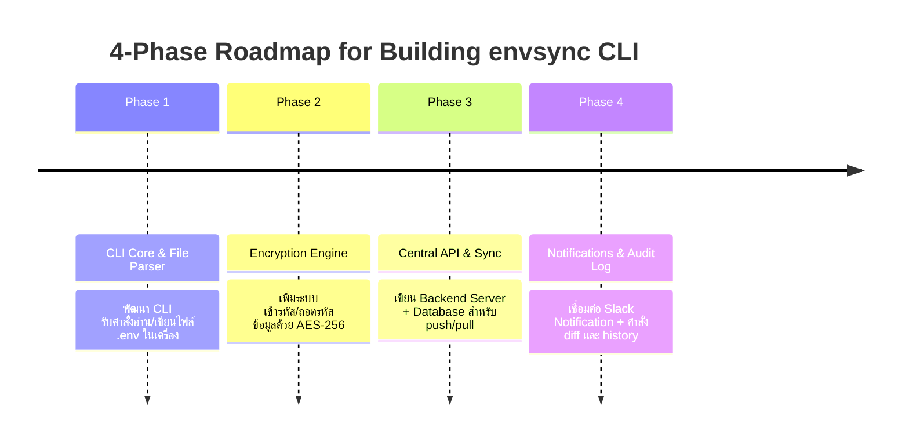

# 📄 ข้อเสนอโครงการ & แผนงานทางเทคนิค: `envsync` (Dev Environment Config Sync CLI)

**สายงาน:** Platform Engineering / Developer Experience (DevEx)  
**เป้าหมาย:** สร้างเครื่องมือ CLI ระดับองค์กรที่ช่วยจัดการ ป้องกัน และซิงก์ไฟล์ `.env` และ Config สำหรับการพัฒนาซอฟต์แวร์ระหว่างคนในทีมให้ปลอดภัยและตรงกันเสมอ  
**งบประมาณประมาณการ:** 0 บาท (พัฒนาและทดสอบบนเครื่องตัวเอง 100%)

---

## 📌 1. ปัญหาในทีมพัฒนาจริงที่เครื่องมือนี้แก้ (Problem Statement)

1. **"ขอไฟล์ `.env` หน่อย":** สมาชิกใหม่เข้าทีมมาต้องคอยทักแชตขอไฟล์ `.env` จากเพื่อนร่วมทีม
2. **ความไม่ปลอดภัย:** ทีมแอบส่งรหัสผ่าน, API Keys หรือ Database Connection Strings ผ่าน Slack, Line หรือ Email
3. **Configuration Drift:** เมื่อมีคนอัปเดตค่า Config ใหม่ในเครื่องตัวเองแล้วไม่ได้บอกคนอื่น ทำให้โปรเจกต์ของเพื่อนรันไม่ผ่านและเสียเวลา Debug เป็นชั่วโมง

---

## 🏗️ 2. สถาปัตยกรรมระบบ (System Architecture)

```mermaid
graph TD
    subgraph Developer Laptop
        DevA[ Developer A ] -->|1. envsync push| CLIClient[ envsync CLI Tool ]
        CLIClient -->|Encrypts AES-256| LocalENV[ Local .env File ]
    end

    subgraph Backend & Storage
        CLIClient <-->|2. HTTPS Encrypted Payload| BackendAPI[ envsync Central Server\n(Go / Node.js REST API) ]
        BackendAPI <-->|Store Config & Audit Logs| Database[( Database: SQLite / PostgreSQL )]
        BackendAPI -->|3. Webhook Notification| Slack[ Slack / Discord Channel ]
    end

    subgraph Teammate Laptop
        Slack -->|Notifies Team| DevB[ Developer B ]
        DevB -->|4. envsync pull| CLIClientB[ envsync CLI Tool ]
        CLIClientB <-->|Fetch & Decrypt| BackendAPI
        CLIClientB -->|Updates| LocalENVB[ Local .env File ]
    end
```

---

## 💻 3. ตัวอย่างประสบการณ์การใช้งาน (Developer User Experience & CLI Commands)

### 3.1 การเริ่มต้นใช้งานในโปรเจกต์ (`envsync init`)
เชื่อมต่อโปรเจกต์ปัจจุบันเข้ากับพื้นที่ส่วนกลาง:
```bash
$ envsync init --project payment-service

✔ Project 'payment-service' initialized successfully.
✔ Config file .envsync.json created.
```

### 3.2 การอัปเดตค่า Config ขึ้นส่วนกลาง (`envsync push`)
อ่านไฟล์ `.env` ในเครื่อง เข้ารหัส แล้วส่งขึ้น Server ส่วนกลางพร้อมส่งการ์ดแจ้งเตือนใน Slack:
```bash
$ envsync push --env dev --message "Add Redis connection timeout"

🔒 Encrypting environment variables (AES-256-GCM)...
⬆️  Pushing 14 variables to project 'payment-service' (environment: dev)...
✅ Successfully updated! 
📢 Notification sent to #dev-team Slack channel.
```

### 3.3 การดึงค่า Config ล่าสุดมาลงเครื่อง (`envsync pull`)
ดึงค่าล่าสุดมาอัปเดตไฟล์ `.env` ในเครื่อง พร้อมแสดงความแตกต่าง (Diff):
```bash
$ envsync pull --env dev

⬇️  Fetching latest config for 'payment-service' (dev)...
🔓 Decrypting environment variables...

Changes applied to .env:
  + ADDED: REDIS_TIMEOUT=5000
  ~ MODIFIED: DB_MAX_CONNECTIONS (10 -> 25)

✔ Local .env file updated successfully!
```

### 3.4 การเปรียบเทียบค่าโดยยังไม่อัปเดต (`envsync diff`)
```bash
$ envsync diff --env dev

Comparing local .env with remote (dev):
  [Local]  DB_HOST=localhost
  [Remote] DB_HOST=dev-db.internal.company.com (Out of sync!)
```

### 3.5 การตรวจสอบประวัติการเปลี่ยนแปลง (`envsync history`)
```bash
$ envsync history

REV  DATE                 USER           CHANGES
v4   2026-08-02 14:10    @naeiger       Added REDIS_TIMEOUT
v3   2026-08-01 09:30    @alex_dev      Updated DB_HOST
```

---

## 🛠️ 4. เทคโนโลยีที่ใช้ในการพัฒนา (Tech Stack)

### Part 1: ตัวเครื่องมือ CLI (Client Tool)
* **Language:** **Go** (แนะนำมากสำหรับสาย CLI เพราะต่อเป็น Single Binary `.exe` หรือ `binary` พกพาง่าย) หรือ **Node.js/TypeScript** (ใช้ `Commander.js`)
* **CLI Library:** `Cobra` (ภาษา Go) หรือ `Commander` / `Inquirer.js` (ภาษา Node.js)
* **Encryption:** AES-256-GCM (หรือใช้ Public/Private RSA Key pair ต่อผู้ใช้)

### Part 2: ระบบหลังบ้านส่วนกลาง (Central Storage & API Server)
* **Backend API:** ภาษา Go / Node.js (REST API สั้นๆ สำหรับรับ-ส่ง Payload ที่เข้ารหัสแล้ว)
* **Database:** SQLite (สำหรับ Local Dev) หรือ PostgreSQL / Supabase
* **Integration:** Slack Webhook API (แจ้งเตือนเมื่อมีการอัปเดต Config)

---

## 🗓️ 5. แผนการพัฒนาทีละขั้นตอน (Implementation Roadmap)



---

## 🌟 6. คุณค่าของโปรเจกต์นี้ในสัมภาษณ์งาน (Portfolio Highlights)

1. **พิสูจน์ทักษะ Internal Tooling:** แสดงว่าคุณไม่ได้แค่ใช้เครื่องมือคนอื่นเป็น แต่สามารถ **สร้างเครื่องมือทางวิศวกรรม (Engineering Tools)** ขึ้นมาแก้ปัญหาจริงให้ทีมได้
2. **เน้น Security & Data Safety:** แสดงความเข้าใจเรื่องความปลอดภัยของข้อมูล (Encryption at Rest / In Transit) ซึ่งเป็นหัวใจสำคัญของ Platform Engineer
3. **เล่า Story ในการสัมภาษณ์งานได้โดดเด่น:**
   > *"ผมเห็นปัญหาว่าทีมชอบส่งไฟล์ .env และรหัสผ่านกันทาง Slack ทำให้เกิดความไม่ปลอดภัยและ Config ไม่ตรงกัน ผมเลยเขียน CLI Tool ชื่อ `envsync` เพื่อให้ทีมซิงก์ Config ที่เข้ารหัสแล้วได้ด้วยคำสั่งเดียว พร้อมแจ้งเตือนใน Slack ช่วยลดเวลาที่เสียไปกับการ Debug เรื่อง Config ผิดพลาดไปได้มาก"*

---
*เอกสารจัดทำเมื่อ: 2026-08-02*
